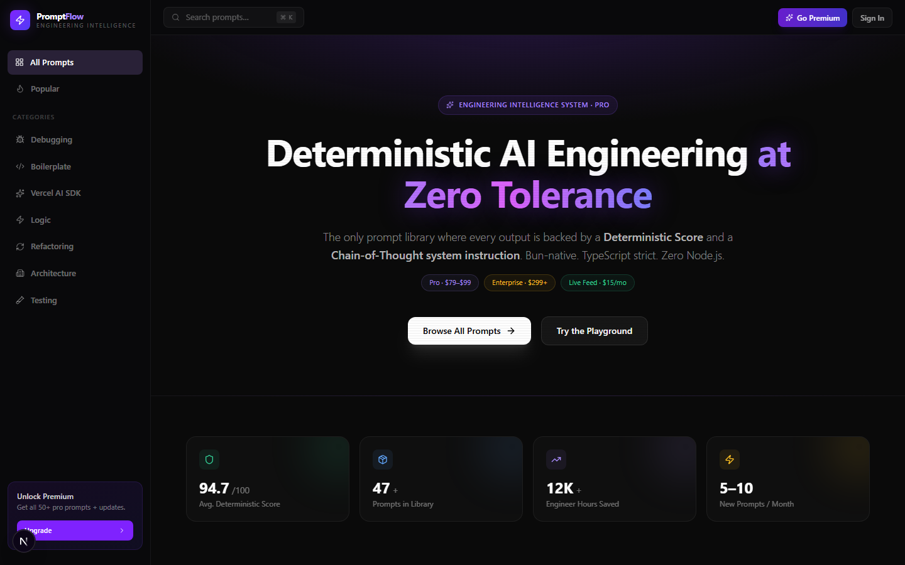

<div align="center">
  
  
  <h1>🌊 Prompt-Flow Pro</h1>
  <p><strong>The Elite Engineering Intelligence System for Bun.js & Next.js 15</strong></p>

  <p>
    
    
    
    
  </p>
</div>

---

**Prompt-Flow Pro** is an elite, deterministic engineering layer optimized for modern software delivery. It eliminates the trial-and-error of standard AI tools by wrapping raw prompts in rigorous, model-specific "Chain-of-Thought" structures and automatically injecting multi-file workspace context.

---

## 📊 The "Pro" Evolution

| Feature | Standard AI Usage | Prompt-Flow Pro |
| :--- | :--- | :--- |
| **Output Consistency** | Hallucinations & guesswork | **Deterministic Scoring System (90+ DET)** |
| **Context Assembly** | Manual copy-pasting | **Drag-and-Drop Multi-File Context Injector** |
| **Model Optimization** | One-size-fits-all prompts | **Claude XML CoT, GPT-4o Markdown, Cursor File-Aware XML** |
| **Monetization Model** | One-time low-value sale | **Value Ladder: Pro Launch, Enterprise License, Live Feed** |
| **Core Architecture** | Generic prompt storage | **TypeScript-driven System Engine** |

---

## 🎯 Real-World Impact & Problem Solving

The problem with current AI models is not intelligence—it is **context alignment** and **format compliance**. Developers waste hours coaxing conversational LLMs to use the correct library versions, stop hallucinating Node.js APIs in a Bun environment, or write proper Zod schemas.

**Prompt-Flow Pro solves this by:**
- **Automated Context Parsing:** Automatically stripping `package.json` dependencies and `tsconfig.json` path aliases to feed the LLM the exact constraints of your workspace.
- **Priority Stack Trace Injection:** Ensuring that runtime fixes are hyper-focused on the exact failing line of code.
- **Vercel AI SDK Layer:** Bridging the gap to production by generating deterministic `streamObject` schemas and type-safe `tool()` handlers.

> **Efficiency Gain: ~45 minutes of manual debugging → ~2 minutes of deterministic generation.**

---

## 👨‍💻 Who This Is For

- **Senior Engineers** who require zero-hallucination code generation.
- **Tech Leads & Startups** looking to scaffold full-stack architectures (Drizzle, Elysia, Next.js) reliably.
- **AI Application Builders** needing deterministic tool calling and streaming handlers via the Vercel AI SDK.

---

## 🛠️ Technical Architecture

- **Frontend Design**: A hyper-modern Bento Grid UI featuring a deep charcoal background (`#0A0A0A`) with Emerald Green (`#10B981`) accents. Prompt cards feature a 60fps rotating `conic-gradient` neon ring indicating its Deterministic Score.
- **Interactions**: Built natively with Framer Motion. Hovering over a prompt card gracefully slides down an accordion detailing specific Claude and Cursor model optimizations.
- **System Engine**: Pure TypeScript compilation of user inputs into strict semantic formats (XML/MD).
- **Multi-Action Export**: A single sleek dropdown UI button that transpiles context specifically for:
  - **Claude (XML)**: Using `<chain_of_thought_protocol>`
  - **GPT-4o (MD)**: Using hierarchical constraints
  - **Cursor (Agent)**: Emitting explicit `@package.json` and `@tsconfig.json` directives.

## 🛡️ Security & Privacy

Prompt-Flow Pro is built on a **Local-First** privacy architecture. 
- **Client-Side Processing**: All file parsing (package.json, tsconfig.json) happens purely in your browser's memory. 
- **Zero Data Exit**: We never transmit your source code or project metadata to a remote server. 
- **CLI Signal**: Context injection via the CLI remains entirely within your local `localhost` loop.
👉 **[Read our Security Disclosure](SECURITY.md)**

---

## 🚀 Getting Started

### 1. Unified CLI Workflow (Recommended)
Automatically sync your project context with the Pro dashboard:
```bash
# In your project root
bunx prompt-flow
```

### 2. Manual Installation
1. **Clone the Repo:**
   ```bash
   git clone https://github.com/pavankumar9d-rgb/prompt-flow.git
   cd prompt-flow
   ```
2. **Install Operations:**
   ```bash
   bun install
   ```
3. **Run Development Server:**
   ```bash
   npm run dev
   ```

---
<div align="center">
  <i>Architected by the Prompt-Flow Engineering Team · Built for elite engineering teams.</i>
</div>
